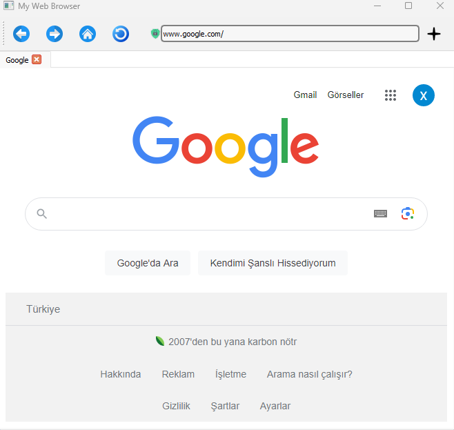

# Python Browser



Python Browser is a lightweight web browser built using Python. It provides a simple and customizable browsing experience.

## Features
- **Fast and Lightweight:** Python Browser is designed to be lightweight and efficient, offering a speedy browsing experience.
- **User-Friendly Interface:** The browser has a clean and intuitive interface, making it easy to navigate and use.
- **Tabbed Browsing:** Open multiple tabs and switch between them seamlessly.
## Installation
Follow the steps below to install and run Python Browser:

1. Clone the repository:
   ```shell
   git clone https://github.com/ByNexter/PythonBrowser.git
